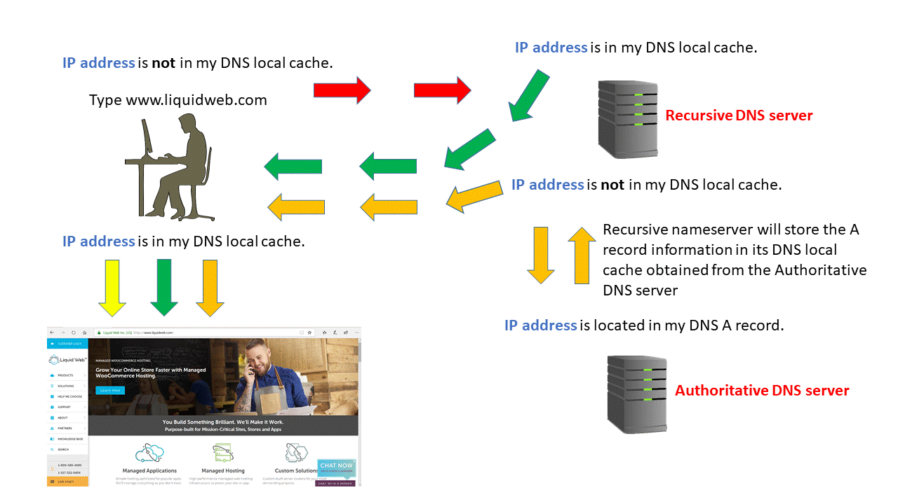

모든 PC는 DNS server의 IP address가 설정되어 있어야 한다.  
보통 PC는 DHCP protocol로 IP address를 할당 받으면서  
DNS server의 IP address를 DHCP Option 6 을 통해 함께 받는다
(즉, DNS IP address가 2개이다)

구체적으로 어떠한 과정을 거치는지 아래에서 살펴보자

##DNS Recursive process

위 그림에서처럼 local PC DNS server가 여러 DNS server를 거쳐  
필요한 IP address를 찾는 과정, 즉 아래에 설명한 과정  
(Root DNS server -> com DNS server -> naver.com DNS server)을  
**Recursive Query**라고 한다

1. PC의 browser에서 URL(https://www.naver.com/index.html)을 입력하면 PC는 미리 설정되어 있는 DNS(local DNS)에게 `www.naver.com(hostname)`에 대한 `IP address`를 물어본다. 만약 있다면 PC에 해당 `IP address`를 주고 끝
2. 없다면 `www.naver.com(hostname)`에 대한 `IP address`를 찾아내기 위해 Root DNS server와 통신(DNS message 주고받기 위해 local DNS server에 Root DNS server의 `IP address`가 설정되어 있어야 함
3. 만약 있다면 해당 `IP address` 전달, 없다면 4번으로
4. `com domain`을 관리하는 DNS server 와 통신(DNS message 주고받기)
5. 만약 있다면 해당 `IP address` 전달, 없다면 6번으로
6. `naver.com domain`을 관리하는 DNS server 와 통신
7. 해당 DNS server에는 `www.naver.com(hostname)`에 대한 `IP address`가 있으므로 local DNS server에게 `IP address`를 전달
8. local DNS server는 해당 `IP address`를 caching 한 후 해당 `IP address`를 PC에게 전달

##DNS Lookup process

해당 DNS server를 방문했을때 `IP address`를 찾는 과정은 아래와 같다

1. Requesting website information
   1. web browser에 domain name 을 입력한다
   2. PC가 hostname을 파악한다
   3. PC가 `IP address`를 local DNS cache에서 찾는다
      - 있다면 -> `IP address`로 request 한다
      - 없다면 -> 위의 Recursive 한 process를 위해 DNS query 를 보낸다
2. Contact the Recursive DNS servers
   1. Recursive DNS server들은 각자의 local DNS cache가 있다 먼저 그 local DNS cache에 해당 `IP address`가 있는지 찾는다
3. Query the Authoritative DNS server
   1. 만약 local DNS cache에 없다면 DNS query는 authoritative DNS server를 찾아간다
   2. authoritative DNS server는 DNS records를 가진다
4. Access the DNS record
   1. authoritative name server 에 query 하여 DNS record를 찾는다
   2. 해당 name의 DNS record 를 찾으면 local DNS cache에 저장한다
5. Final DNS step
   1. recursive DNS server에서 DNS record를 전달받는다
   2. DNS record에서 `IP address`를 읽는다
   3. `IP address`를 browser에게 준다
   4. browser는 `IP address`와 일치하는 server에게 request를 보낸다

##hostname과 url의 차이

- URL: https://www.naver.com/index.html
- hostname: www.naver.com
- Top-level Domain name: .com
- Second-level Domain name: .naver.com

##references

- https://www.liquidweb.com/kb/understanding-the-dns-process/
