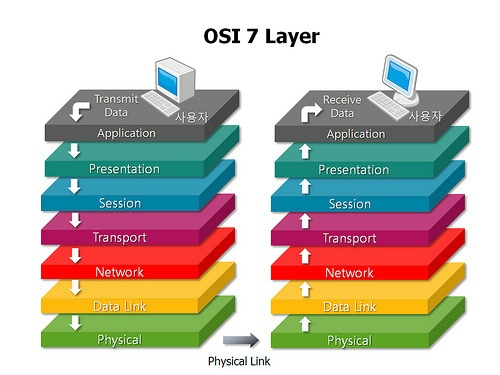
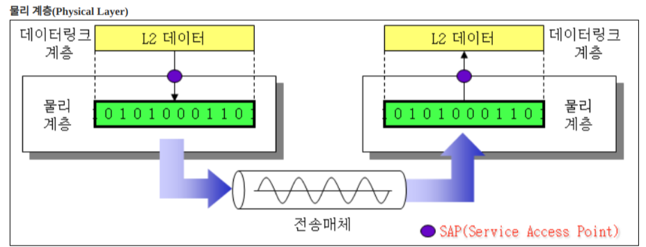
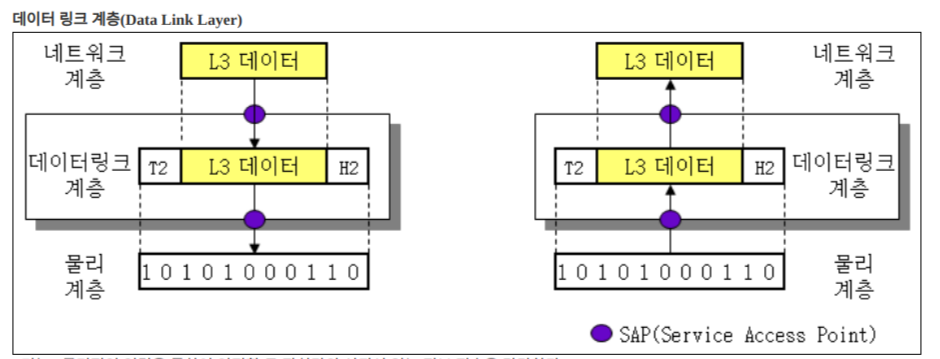
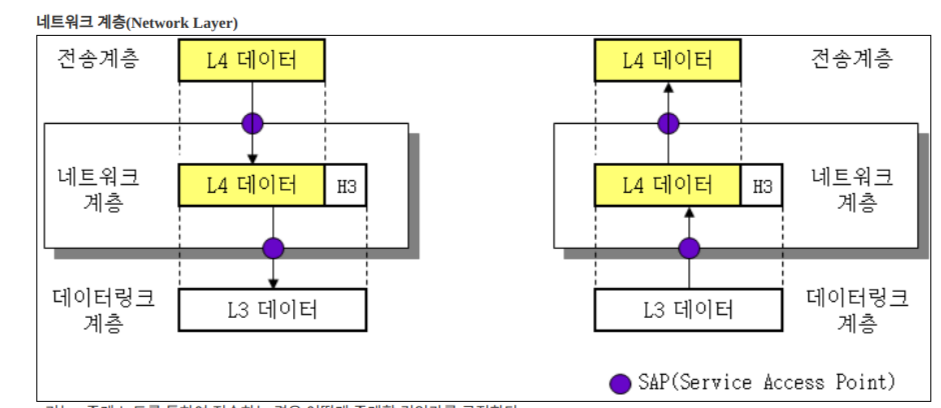
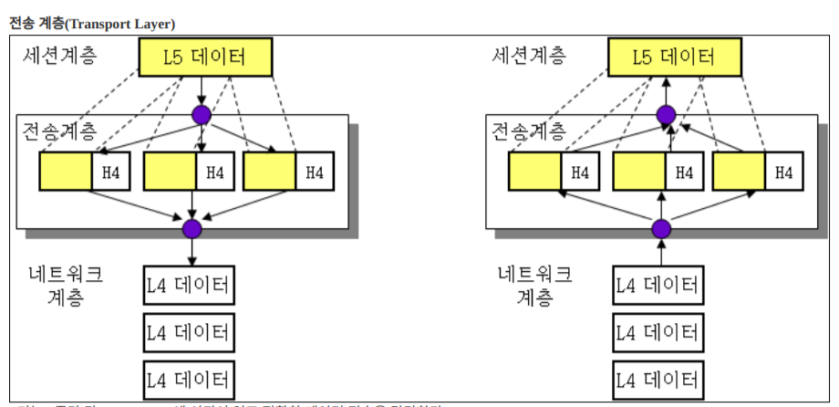
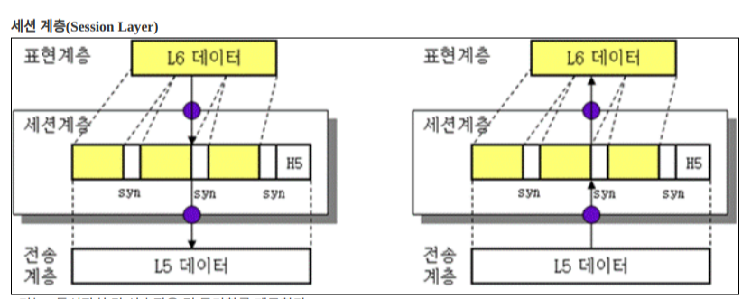
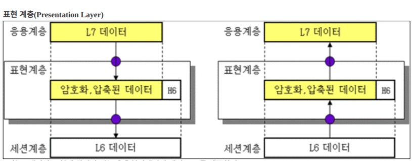
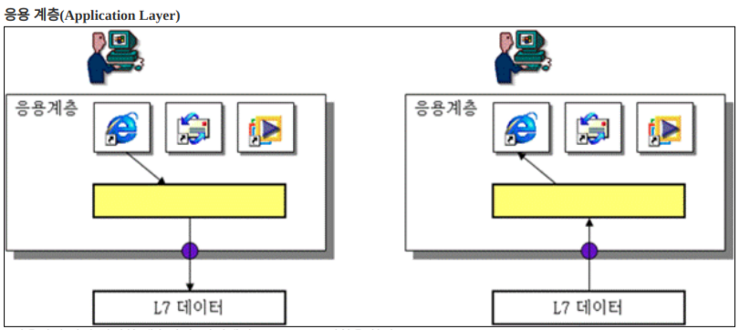

##OSI 7 layer

OSI(Open System Interconnection)는  
ISO(International Organization for Standardization) 즉, 국제 표준 기구가 결정한  
시스템 사이 네트워크 표준 모델이다

표준이자 학습도구로 쓰인다

##1. Physical layer

- data link layer 의 frame을 받고, 다음 장치에 구리나 광섬유(케이블) 또는 무선 통신 매체를 통신해 전송하기 위한 신호로 바꾸어 준다
- 전송 단위: 비트(bit)
- 장비: 허브, 리피터, connector 등

##2. Data link layer

- network layer의 packet 을 받고, 물리적 매체에 실어 보내는 역할. 오류 검출 및 오류 제어 기능 수행
- 전송 단위: frame
- protocol: Ethernet 등
- 장비: bridge, switch

##3. Network layer

- 상위 layer의 data를 packet 안으로 캡슐화하여 data 종류에 상관없이 한 호스트에서 다른 호스트로 packet들을 라우팅
- 전송 단위: packet
- protocol: IP 등
- 장비: router

##4. Transport layer

- data를 전송할 목적지 설정. 즉, 헤더에 송수신지 포트번호를 포함하여 올바르게 전달 될 수 있게 하는 계층
- 전송 단위: TCP - secment/ UDP - datagram
- protocol: TCP, UDP
- 장비: gateway

##5. Session layer

- 양 끝단의 응용 프로스세가 통신을 관리하기 위한 방법을 제공. 포트 번호를 기반으로 연결
- 전송 단위: message
- protocol: SSH

##6. Presentation layer

- application layer 와 session layer 사이 data 전송이 원할하도록 data의 형태를 변화하는 역할. 코드 변환, 구문 검색, data 암축 및 암호화 등
- 전송 단위: message
- protocol: JPG, MPEG 등

##7. Application layer

- 응용 프로세스와 직접 관계하여 interface의 역할을 수행. 정보 교환, 전자 메일, 파일 전송 등
- 전송 단위: message
- protocol: HTTP, FTP, DNS 등
