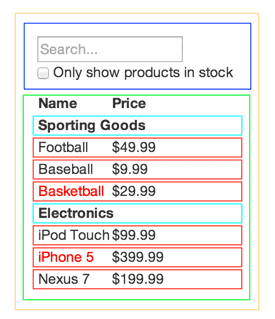

(React 공식문서의 main concepts 번역 글입니다.)  
  
**함께보면 이해가 쏙쏙**  
https://youtu.be/T6Wj2pbkorA  
  
React는 Javascript로  
규모가 있는 Web app을 만드는 빠른 방법이다.  
  
이번 글에서는 React를 활용해서 제품 검색 App을 구현할 것이다.  
구체적인 예시(제품 검색 App)를 React로 직접 구현하면서  
그 과정을 익혀보자.

##Mockup design으로 시작하자
먼저 JSON API와 UI모형 디자인을 가지고 있다고 가정하자.  
UI모형 디자인은 아래 사진과 같은 모양일 것이다.  


JSON API가 return 하는 data의 형태는 아래와 같다.

```js
[
  {category: "Sporting Goods", price: "$49.99", stocked: true, name: "Football"},
  {category: "Sporting Goods", price: "$9.99", stocked: true, name: "Baseball"},
  {category: "Sporting Goods", price: "$29.99", stocked: false, name: "Basketball"},
  {category: "Electronics", price: "$99.99", stocked: true, name: "iPod Touch"},
  {category: "Electronics", price: "$399.99", stocked: false, name: "iPhone 5"},
  {category: "Electronics", price: "$199.99", stocked: true, name: "Nexus 7"}
];
```

##STEP1. UI 요소를 component 단위로 쪼개기
첫번째, component로 구성할 부분에 _박스를 그리자_.  
그리고 _박스로 구분한_ 각 component들에게 이름을 붙이자.  
  
만약 디자이너와 일한다면 이미 위 작업을 했을 수 있다.  
디자이너와 얘기해서 포토샵의 layer 이름을 물어보자.  
layer 이름을 component 이름으로 사용할 수 있다.  

###component 쪼개기 기준?  
어떠한 기준으로 component를 쪼개어야 할지 모른다면?  
새로운 function 혹은 object를 만드는 기준을 적용하자.  
그 기준 중 하나는 **single responsibility principle**  
즉, component는 _한가지 로직만_ 수행해야 한다는 것이다.  
(input 1개 output 1개)  
  
만약 component가 복잡해져서 두가지 이상의 로직을 수행한다면  
해당 component는 _더 작은_ component로 쪼개야 한다.  
  
JSON data model을 토대로 UI를 구성하기 때문에  
component를 쪼개는 **기준**은  
UI보다 **data model**이 더 적합하다.  
하나의 data model을 완벽히 보여줄 수 있도록  
component를 쪼개자  

###제품 검색 App을 구성하는 component


우리가 만드는 제품 검색 App은 5개 component로 구성되어 있다.  
5개 component들 각각의 역할을 아래에 설명했다.  
(component가 보여주는 data는 _이탤릭체_ 로 표시했다.)

1. **FilterableProductTable(오렌지색):** 전체를 포함하는 component
2. **SearchBar(파란색):** 모든 input tag의 _value_ 값 받는다
3. **ProductTable(초록색):** _data모음_ 을 input tag _value_ 값을 기준으로 filtering 하고 보여준다
4. **ProductCategoryRow(청록색):** 각 _category_ 의 이름을 보여준다
5. **ProductRow(빨간색):** 각 product의 _data_ 를 보여준다.

3번 `ProductTable` component를 보면  
표의 header(Name, Price 글자)만 포함하는 것이 아니라  
표 전체를 포함하고 있음을 확인할 수 있다.  
`ProductTable`에서 header의 역할이 보여주는 것 뿐이어서  
(render 로직 1가지만 수행함 **single responsibility**)  
header를 따로 분리하여 _component를 만들지 않았다_.  
  
하지만 header에 Name, Price 글자 이외에  
정렬을 위한 요소를 추가하는 경우, 즉 **기능이 추가**되는 경우  
header를 _따로 분리하여_ component로 만드는 것이 적합하다.  

###component의 계층 구조
제품 검색 App에 대한 component 쪼개기가 끝난 후  
component의 계층 구조를 만들자.  
박스로 구분한 component들을 보면서  
**부모 자식 관계**를 설정한다(자식을 포함한 박스가 부모가 됨)  
위 제품 검색 App의 component 계층 구조는 다음과 같다.  
  
- FilterableProductTable
  - SearchBar
  - ProductTable
    - ProductCategoryRow
    - ProductRow

##STEP2. 상호작용이 없는(static한) React page 만들기

```js
 class ProductCategoryRow extends React.Component {
  render() {
    const category = this.props.category;
    return (
      <tr>
        <th colSpan="2">
          {category}
        </th>
      </tr>
    );
  }
}

class ProductRow extends React.Component {
  render() {
    const product = this.props.product;
    const name = product.stocked ?
      product.name :
      <span style={{color: 'red'}}>
        {product.name}
      </span>;

    return (
      <tr>
        <td>{name}</td>
        <td>{product.price}</td>
      </tr>
    );
  }
}

class ProductTable extends React.Component {
  render() {
    const rows = [];
    let lastCategory = null;

    this.props.products.forEach((product) => {
      if (product.category !== lastCategory) {
        rows.push(
          <ProductCategoryRow
            category={product.category}
            key={product.category} />
        );
      }
      rows.push(
        <ProductRow
          product={product}
          key={product.name} />
      );
      lastCategory = product.category;
    });

    return (
      <table>
        <thead>
          <tr>
            <th>Name</th>
            <th>Price</th>
          </tr>
        </thead>
        <tbody>{rows}</tbody>
      </table>
    );
  }
}

class SearchBar extends React.Component {
  render() {
    return (
      <form>
        <input type="text" placeholder="Search..." />
        <p>
          <input type="checkbox" />
          {' '}
          Only show products in stock
        </p>
      </form>
    );
  }
}

class FilterableProductTable extends React.Component {
  render() {
    return (
      <div>
        <SearchBar />
        <ProductTable products={this.props.products} />
      </div>
    );
  }
}

const PRODUCTS = [
  {category: 'Sporting Goods', price: '$49.99', stocked: true, name: 'Football'},
  {category: 'Sporting Goods', price: '$9.99', stocked: true, name: 'Baseball'},
  {category: 'Sporting Goods', price: '$29.99', stocked: false, name: 'Basketball'},
  {category: 'Electronics', price: '$99.99', stocked: true, name: 'iPod Touch'},
  {category: 'Electronics', price: '$399.99', stocked: false, name: 'iPhone 5'},
  {category: 'Electronics', price: '$199.99', stocked: true, name: 'Nexus 7'}
];

ReactDOM.render(
  <FilterableProductTable products={PRODUCTS} />,
  document.getElementById('container')
);
```

component 계층 구조가 완성된 후, 비어있는 App을 채울 차례다.  
가장 쉬운 방법은 **상호작용이 없는 React page**를 만드는 것이다.  
물론 **data model을 가져와서 보여주는** UI로 구성된 page이다.  
  
사용자와 상호작용이 없는 React page를 만드는 과정과  
그 React page가 상호작용할 수 있도록 만드는 과정을 _분리하자_.  
왜냐하면 상호작용이 없는 React page를 만드는 과정은  
생각없이 타자만 치면 되는 노가다인 반면에,  
상호작용이 있는 React page를 만드는 과정은  
타자치기보다는 생각을 정말 많이 해야하기 때문이다.  
  
###상호작용이 없는 App 구현 시 component의 특징
data model을 효율적으로 보여주는 App을 만들기 위해서는  
다른 component를 재사용하고, data를 props로 전달하는  
component로 App을 구성해야 한다.  
  
props는 부모에서 자식으로만 전달될 수 있다.  
따라서 props는 _바뀌는 data를 표현할 수 없다_.  
바뀌는 data를 표현하기 위해서는 **state를 사용**해야 하지만  
상호작용이 없는 React page에서는 _data가 바뀌지 않으므로_  
현재 단계에서는 아직 _state를 사용하지 않아도_ 된다.  
(state가 없으므로 render()만 있다.)

###구체적인 App 구현 방법과 동작 원리
App을 만들때, 하위 component(ProductRow)부터 만들 수도 있고  
상위 component(FilterableProductTable)부터 만들 수도 있다.  
계층구조가 **복잡한 App**은 _하위 component부터_ 구현하는 편이고  
계층구조가 **간단한 App**은 _상위 component부터_ 구현하는 편이다.  
현재 App은 간단한 App에 속하므로 상위 component부터 구현하자.  
  
또한, 현재 App은 상호작용이 없는 App이기 때문에  
이 App을 구성하는 모든 component들은 _render() method 만_ 있다.  
이 component들의 동작 원리는 아래와 같다.  

1. 계층 구조 꼭대기에 있는 `FilterableProductTable`는  
data model을 **props**로 전달 받는다.  
2. 이 data model에 속한 data, 즉 _**props**의 값을 바꾼다._  
3. 다시 `ReactDOM.render()`를 호출한다.  
4. UI는 바뀐 data 값을 반영하여 업데이트 될 것이다.  
  
> React에서 data는 위에서 아래로만 전달된다.(one-way data flow)  

이러한 특징때문에 React는 **모듈화**하기 쉽고 속도가 **빠르다**.  

###Props vs State
React에서는 2가지 data model의 형태(props와 state)가 있다.  
props와 state의 _차이_ 를 이해하는 것은 중요하다.  
앞에 state편 블로깅을 참고하여 반드시 둘의 차이를 이해하자.  

##STEP3. state에 할당할 수 있는 핵심 data 찾기
상호작용이 가능한 React page를 만드려면  
data model의 _data 값을 바꿀 수_ 있어야 한다.  
이는 React에서 **state**를 활용하면 가능하다.  
  
제품 검색 App이 상호작용이 가능하도록 만들기 위해서  
state에 할당할 수 있는 **핵심 data**을 찾자.  
핵심 data란 다른 data(props, state)로부터  
계산을 통해 얻을 수 없는 data를 말한다.  
또한 핵심 data는 최소한의, 필수적인 바뀌는 data값이다.  
이러한 핵심 data를 찾지 못하면 state를 _중복_ 할당하게 된다.  
이때 기준이 되는 _DRY_ 를 기억하자(_Don't Repeat Yourself_)  
핵심 data를 찾았다면 이를 state에 할당하자.  
  
예를 들어 TODO list 앱을 만들거라면  
TODO item을 담은 array를 state에 할당해야 한다.  
그럼 TODO item의 개수를 state로 중복 할당하지 않을 수 있다.  
array.length 값이 TODO item의 개수이기 때문이다.  
  
###핵심 data(state)의 기준
제품 검색 App에서는 어떠한 data를 state에 할당해야 할까?
제품 검색 App에서 모든 data를 나열하면 아래와 같다.

- product 목록
- 검색하기 위해 사용자가 입력한 text
- checkbox의 value
- filtering 된 product 목록

아래 3가지 질문에 대답하며  
위 data들 중 어떠한 data가 핵심 data인지 알아보자.

1. 부모로부터 props로 전달받은 data인가?  
2. 시간이 지나도 값이 바뀌지 않는 data인가?
3. 다른 data(props, state)로부터 계산을 통해 얻을 수 있는 data인가?

위 3가지 질문에 전부 No라고 대답할 수 있는 data가  
핵심 data, 즉 state에 할당할 수 있는 data이다.  
  
###제품 검색 App에서의 state
제품 검색 App의 data목록 중 첫번째 `product 목록`은  
props로 전달받은 data이므로 state에 할당할 수 없다.  
두번째 `사용자가 입력한 text`와 세번째 `checkbox의 value`는  
2가지 다 state에 할당할 수 있다.  
시간이 지나면 값이 바뀌며, 계산을 통해 얻을 수 없기 때문이다.  
마지막 `filtering된 product 목록`은 state에 할당할 수 없다.  
`사용자가 입력한 text`와 `checkbox의 value`를 기준으로  
`product 목록`으로부터 계산을 통해 얻을 수 있기 때문이다.  
  
따라서 state로 활용할 수 있는 data는 아래 2가지이다.  

- 검색하기 위해 사용자가 입력한 text
- checkbox의 value

##STEP4. state를 소유하거나 수정하는 component 정의하기

```js{4,5,6,7}
class FilterableProductTable extends React.Component {
  constructor(props) {
    super(props);
    this.state = {
      filterText: '',
      inStockOnly: false
    };
  }

  render() {
    return (
      <div>
        <SearchBar
          filterText={this.state.filterText}
          inStockOnly={this.state.inStockOnly}
        />
        <ProductTable
          products={this.props.products}
          filterText={this.state.filterText}
          inStockOnly={this.state.inStockOnly}
        />
      </div>
    );
  }
}


const PRODUCTS = [
  {category: 'Sporting Goods', price: '$49.99', stocked: true, name: 'Football'},
  {category: 'Sporting Goods', price: '$9.99', stocked: true, name: 'Baseball'},
  {category: 'Sporting Goods', price: '$29.99', stocked: false, name: 'Basketball'},
  {category: 'Electronics', price: '$99.99', stocked: true, name: 'iPod Touch'},
  {category: 'Electronics', price: '$399.99', stocked: false, name: 'iPhone 5'},
  {category: 'Electronics', price: '$199.99', stocked: true, name: 'Nexus 7'}
];

ReactDOM.render(
  <FilterableProductTable products={PRODUCTS} />,
  document.getElementById('container')
);
```

`FilterableProductTable` 에 state가 추가된 것을 확인할 수 있다.  
다음 단계는 각 component에서 이 state를 소유할지, 혹은 수정할지  
즉 state 관련된 로직을 각 component 내부에서 정의해야 한다.  

React는 component 계층구조 중 _상위에서 하위로만 data가 전달_ 되므로  
어떤 component가 state를 소유해야할지 명확하지 않을 수 있다.  
  
모든 각 state 에게 아래 단계를 적용하여  
어떤 component가 state를 소유할지 결정해보자.  

1. 해당 state에 기반한 data를 보여주는 **모든 component**를 찾자
2. 이 모든 component를 소유한 **공동 component**(계층구조의 상위component)를 찾자
3. 이러한 **공동 component**가 state를 소유해야 한다

> state를 소유할 적합한 component를 찾지 못했다면  
state를 소유하는 새로운 component를 만들고  
이 component를 공동 component의 상위에 위치시키자

###제품 검색 App에서 위 단계를 적용하여 구현하기
구체적인 예시인 제품 검색 App에 위 3단계를 적용해보자

1. `ProductTable`은 state를 기반으로 product list라는 data를 보여주어야 한다.
2. `SearchBar`는 search text와 check box의 값을 보여주어야 한다.
3. 위 두 component를 소유한 공동 component는 `FilterableProductTable`이다.
4. 그러므로 search text와 check box의 값이 state가 되어야 한다.
5. 이 2가지 state는 공동 component인 `FilterableProductTable`가 소유해야 한다.

최종적으로 `FilterableProductTable`가 state를 소유하는 component이다.  
이를 반영하여 아래와 같이 App을 구현할 수 있다.

1. `FilterableProductTable`의 constructor에  
`this.state = {filterText: '', inStockOnly: false}`를 추가한다.  
2. 이 state(filterText, inStockOnly)값을 props로  
`ProductTable`과 `SearchBar`에게 전달한다.  
3. `ProductTable`에서 state(filterText, inStockOnly)값을 기준으로  
product list를 filtering하여 보여준다.  
4. `SearchBar`에서 state(filterText, inStockOnly)값을 기준으로  
form fields 값을 할당한다.

위 단계를 모두 완료하면 제품 검색 App에서 검색이 가능해진다.  

##STEP5. 하위component에서 상위component의 state 수정이 가능하게 만들기
지금까지 props와 state를 _부모에서 자식으로(Top-down)_ 전달하여  
data를 보여주는 App을 구현했다.  
이제 자식이 부모의 data(state)를 수정 가능하도록 만들 차례다.  
Form component가 `FilterableProductTable`의 state를  
수정할 수 있도록 만들어야 한다.  
  
React는 _부모에서 자식으로(한방향으로)_ 만 data가 전달된다.  
이러한 React에서 몇줄의 코드를 추가하면  
**자식이 부모의(역방향으로)** data를 수정할 수 있다.  

STEP4에서 완성된 코드는 사용자 입력(input, checkbox)을 무시한다.  
왜냐하면 자식component(`ProductTable`, `SearchBar`)가  
부모component(`FilterableProductTable`)의 state를  
_수정할 수 없기_ 때문이다.  
  
자식component에서 사용자 입력값을 받아  
부모component의 state값을 수정하려면  
아래 과정을 거쳐 몇줄의 코드를 추가해야 한다.  

1. 부모component가 자신의 setState를  
자식component에게 props로 전달한다.  
2. 자식component에서 사용자 입력값을 받는다.
3. 사용자 입력값을 사용하여 전달 받은 setState를 실행한다.
4. 부모component의 state를 사용자 입력값으로 수정할 수 있다.

위 과정을 제품 검색 App에 적용해보면  

1. `FilterableProductTable`는 setState를  
`SearchBar`에게 props로 전달한다.
2. `SearchBar`에서 사용자 입력값을(searchText) 받는다.
3. 사용자 입력값(searchText)을 매개변수로 setState를 실행한다.
4. `FilterableProductTable`의 state(filterText)의 값이 사용자 입력값(searchText)로 바뀐다.

복잡해 보이지만 몇줄의 코드만 추가하면 가능하다.  
이렇게 props로 setState를 전달하면 기존 data 흐름을 유지할 수 있다.

##마무리
이 글을 통해서 어떻게 React로 component를 쪼개고 App을 구현할지  
아이디어를 얻었길 바란다.  
전통적인 App 구현 방식과는 조금 다를지 모르지만  
React App 구현 방식은 훨씬 읽기 쉽고 모듈화되어 있다.  
게다가 재사용성이 높아 코드가 간결해진다.  
특히 규모가 굉장히 큰 App을 구성할 때  
이 모든 React의 장점은 큰 도움이 된다.  
