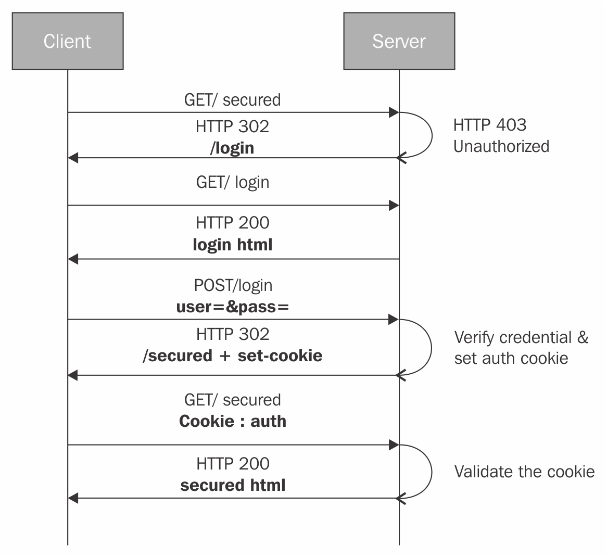

`intro`

> next에서 auth를 구현하는 방법  
> jwt 를 cookie 에 저장 http 통신에 활용

`index`

1. cookie를 활용한 auth 구현 원리
2. cookie 의 생성 방법(response 에 넣어주기)
   - cookie 삭제 방법(exprires = -1)
3. next page 렌더링 할 때 cookie 확인하는 위치
4. getInitialProps 실행 원리
   - server side 에서 cookie 확인
   - client side 에서 cookie 확인
5. auth 실패할 때 및 성공할 때

`outro`

> 왜 jwt 를 localStorage가 아닌 cookie 에 저장하나?
> 보안 문제

## 1. cookie를 활용하여 authenticate 구현 원리



1. client가 server 에게 GET /secured page 를 request 한다
2. server는 unauthorized 된 request 이기에 403 status code 를 보낸다
3. 302 (redirection)으로 /login page 로 response를 보낸다
4. client는 GET /login page 를 request 한다
5. server는 200 status code 와 login page 를 response 한다
6. client는 id 및 password 를 body에 담아서 POST request 한다
7. server는 verify credential(auth)한 후 인증되면 set cookie 하여 response 한다
8. client는 cookie 를 가지고 GET /secured page 를 request 한다
9. server는 cookie 확인 후 인증되면 secured page 를 response 한다

## 2. cookie 생성 방법

위 원리에서 `7. set cookie 하여 response 한다` 가  
server에서 cookie 를 생성하여 client 에게 전달하는 과정이다

```js
app.post('/api/login', (req, res) => {
  const token = 'fake token string' //token 을 만들어 넣어준다
  res.setHeader('Set-Cookie', token) // token 을 cookie 값에 넣는다
  res.status(200).json({ user: mockUser })
})
```

next 에서는 login api를 통해 auth server 로 request 한다
auth server 에서는 cookie 에 jwt 를 담아 response 한다
이 response 에 담긴 cookie 값을 읽어서
login api response 에 다시 set 해주어야 next 에서 활용 가능하다
이 과정은 아래 코드로 구현한다

```js
import { NextApiRequest, NextApiResponse } from 'next'
import axios from 'axios'

import { User } from '@src/types'

export default async (req: NextApiRequest, res: NextApiResponse) => {
  const loginData = req.body

  const response = await axios.post(
    'http://localhost:3001/api/login',
    loginData
  )

  const { user }: { user: User } = response.data

  const token = response.headers['set-cookie']

  res.setHeader('Set-Cookie', `token=${token}; path=/;`)
  res.status(200).json(user)
}
```

위 코드가 login api 코드이다  
response 는 auth server(3001번 포트)에서 받은 것이다  
res는 3000번포트(next 개발 server)에서 받은 것이다  
auth server 에서 cookie 를 통해 jwt 를 받아서  
next 개발 server 에 저장하는 과정은 아래와 같다

1. axios post에 loginData를 담아 auth server 3001번 포트로 request 했다
2. response 로 user data를 받고, response headers에 담긴 token 값을 token 에 저장했다
3. res.setHeader token 을 통해 cookie 안에 token 값을 저장했다

### cookie 삭제 방법

cookie 를 삭제하는 방법은  
cookie 옵션 중 expires 의 값을 -1 로 할당하면 된다  
코드는 아래와 같다

```js
res.setHeader('Set-Cookie', `token=; path=/; expires=-1`)
```

## 3. next page 렌더링 할 때 cookie 확인하는 위치

next 에서는 page 를 렌더링하기 전에  
getIntialProps 라는 page의 method 를 실행한다  
이 method는 page를 렌더링하기 전에 props 를 받아온다

여기서 cookie 를 확인하여 auth 가 성공했는지 확인한다  
성공하면 secure page 를 렌더링하고  
실패하면 login page 로 redirection 한다

## 4. getInitialProps 의 실행 원리

getInitialProps 는 next page 렌더링 위치에 따라  
실행 위치가 달라진다

- SSR(브라우저 url 입력, 첫 렌더링 등) : server 에서 실행
- CSR(Link component 이동, Router.push('url') 등) : client 에서 실행

위에 SSR과 CSR을 어떻게 확인할 수 있을까?  
getIntialProps 의 인자인 ctx 에서  
req 존재 여부에 따라 확인 가능하다

- ctx.req 가 존재하면 SSR
- ctx.req 가 undefined 면 CSR

로 구분할 수 있다  
각 실행 위치(SSR, CSR) 에 따라서 cookie 확인 방법도 다르다

### SSR 일 경우, server side 에서 cookie 확인 방법

ctx.req 가 존재하므로
req.headers.cookie 를 확인하면 cookie 확인이 가능하다

### CSR 일 경우, client side 에서 cookie 확인 방법

ctx.req 가 undefined 이므로  
document.cookie 를 확인하면 cookie 확인이 가능하다

## 5. auth 실패할 때 및 성공할 때

getInitialProps 에서 cookie 에 담긴 jwt 를 확인하여  
auth 를 성공하면 secure page 를 렌더링하고  
실패하면 login page 로 redirection 한다

```js
import cookies from 'next-cookies'

const Index: NextPage = () => {
  const projects = useProjects()

  return (
    <>
      <SPageName>Project List</SPageName>
      <Link href="/project/create">
        <Button type="primary" style={{ float: 'right' }}>
          Create Project
        </Button>
      </Link>
      <Table type="project" datas={projects} />
    </>
  )
}

Index.getInitialProps = (ctx: NextPageContext) => {
  const { token } = cookies(ctx)

  if (!token || token === '') {
    if (ctx.req && ctx.res) {
      ctx.res.writeHead(302, { Location: '/login' })
      ctx.res.end()
    } else {
      Router.push('/login')
    }
  }

  return { token }
}
```

위 코드를 보면 getInitialProps 안에서 token 을 받아오고 있다  
(next-cookies 라는 라이브러리를 활용하면 쉽게 읽어올 수 있다)

만약 token 이 없거나 '' 빈 스트링이라면 auth 가 실패한 것이다  
이때는 login page 로 redirection 해야 한다

redirection 방법은 SSR이냐 CSR이냐에 따라 달라진다

- SSR : `ctx.res.writeHead(302, { Location: '/login' })`
- CSR : `Router.push('/login')`

위 방법을 사용하여 auth 실패하면 /login page 로 redirection 한다
성공하면 return token 하여 secure page 를 렌더링한다

## 보안 관련 문제

cookie 에 jwt 를 저장한 이유는 보안 관련 문제이다  
이는 추후 블로깅을 통해 작성하겠다
