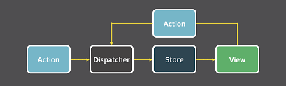
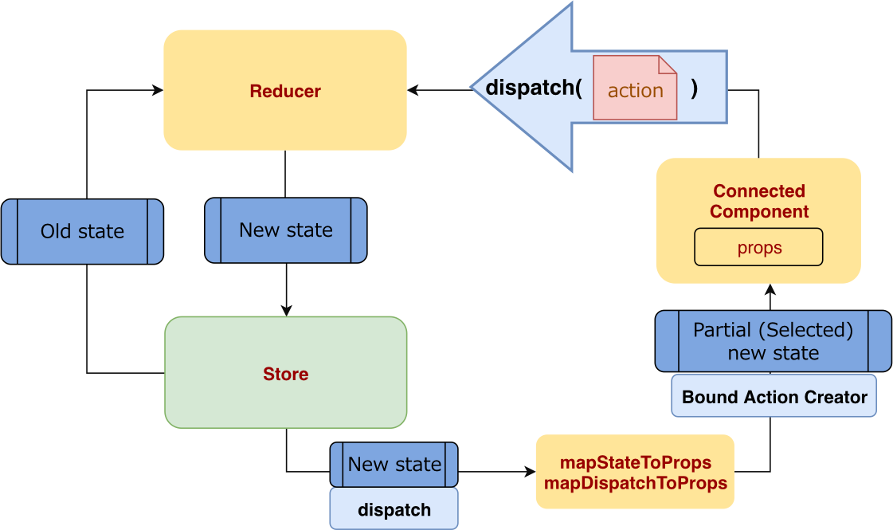

flux란 기존 MVC 패턴의 한계를 극복하기 위해 만들어진  
새로운 웹개발 패턴이다.  
  

위 그림은 기존 MVC 패턴의 한계를 설명한다.  
MODEL과 VIEW가 **양방향**으로 서로에게 영향을 줄 수 있으므로  
MODEL과 VIEW의 수가 증가할수록 디버깅하기 어려워진다.  

반면 flex는 **단방향**의 data 흐름을 가진다.  
따라서 앱의 규모가 커져도 MVC에 비해 디버깅하기 쉽다.  

##flux구조
flux는 4가지 개념으로 구성되어 있다.

- Action
- Dispatcher
- Store
- View

각각은 **단방향**으로 data가 흘러가도록 역할을 수행한다.  

###Action
Action은 View에서 발생하며 Dispatcher에게 전달된다.  
보통 click 등 여러 유저 행동을 나타낸다.

###Dispatcher
Action을 Store에게 전달하는 역할을 한다.  

###Store
Dispatcher에게 Action을 전달받아서 상태를 변화시킨다.  
변화시킨 상태를 저장하는 저장소이기도 하다.  

###View
Store에게 상태를 전달받아 렌더링하는 역할을 담당한다.

###flux의 아쉬운 점
flux에서 Store는 2가지 역할을 담당한다.

- state 저장소
- state 변화 로직 수행

따라서 개발자가 개발하며 state 변화 로직을 수정하면  
기존에 저장되어 있던 state가 전부 새로고침되어 사라진다.  
  
> 이러한 한계를 극복하기 위해 Redux가 등장했다

##Redux

어떻게 flux의 한계를 극복했느냐  
store를 reducer와 store로 분리하여 극복했다.  
기존 flux의 store가 수행하던 2가지 역할을 나눠 수행한다.  

###Redux를 구성하는 기본 개념

- **store** : state 저장소
- **reducer** : state 변화 로직 수행

위 2가지 개념에 덧붙여, 기존 flux에서 몇몇 개념이 추가 및 수정되어  
아래와 같은 개념 목록으로 Redux가 구성되었다.  

- **dispatch** : 기존 state를 수정하는 객체인 action을 전달하는 매개 함수다. View에 속한 component에서 state를 변화시키는 method를 dispatch에 담아 reducer에게 전달할 수 있다.  
- **mapStateToProps** : 말그대로 store의 state를 View 속한 특정 component에게 props로 전달하는 함수이다
- **mapDispatchToProps** : state대신 dispatch를 component에게 props로 전달하는 함수이다

### A component에서 state를 변화시키고 B component에서 변화한 state를 렌더링하고 싶을 때

위와 같은 상황에서 redux가 동작하는 과정은 아래와 같다.  

1. `action type`을 상수로 정의한다
2. `action creator`를 정의한다(action 객체 생성 함수)
3. 해당 `action`이 `reducer`에서 어떻게 `state`를 바꿀지 정의한다
4. `reducer`와 `action`을 input으로 `store`를 생성한다
5. `Provider`를 통해 모든 `component`를 `store`에 접근할 수 있도록 만든다
6. 정의된 `action`을 `mapDispatchToProps`를 통해 `A component`에게 전달한다
7. `A component`에서 `props` 를 활용해 `state`를 변화시키는 `action`을 `dispatch`를 통해 `reducer`에게 전달한다
8. `reducer`는 기존 `state`와 `action`을 받아서 바뀐 `state` 값을 `store`에게 전달한다
9. `store`에 저장되어있는 바뀐 `state`값을 `mapStateToProps`를 통해 `B component`에게 전달한다
10. 바뀐 `state`를 `props`로 받아 `B component`가 렌더된다
