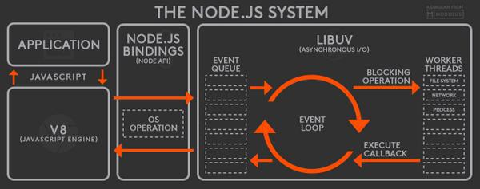

##Node.js란?
javascript runtime이다.  
브라우저 외 환경에서도 javascript를 실행할 수 있게 한다.  
CPU 사용이 적지만 connection이 많은 웹 어플리케이션에 어울린다.  
싱글스레드, 비동기 이벤트 위주 IO, 논블라킹 등의 특성 때문이다.

###Node.js의 특징

- 싱글스레드: 문맥교환으로 인한 오버헤드가 없다
- 비동기 IO: CPU의 time loss 피함. io요청있으면 워커스레드에게 던져놓고 계속 실행
- 이벤트 기반: epool 또는 kqueue를 사용
- 경량 프레임워크
- 풍부한 라이브러리
- 서버와 클라이언트의 언어(JS)가 같음: 생산성 향상

##Node.js의 아키텍쳐

상위 레벨은 javascript로 되어있고 로우레벨은 C, C++로 구성  

- 자바스크립트 라이브러리
- 바인딩: js를 C, C++로 처리
- V8엔진
- libuv: 리눅스의 libeio와 윈도우의 IOCP를 추상화시켜 맨 위에서 동작

###application, event loop는 싱글스레드 & 워커스레드는 멀티스레드
application 즉, 개발자가 입력하는 곳에서는 싱글스레드, call stack 하나.  
또한 event loop도 싱글스레드 따라서 하나의 루프가 계속 돌며 작업완료 체크.  
  
하지만 io를 처리하는 워커스레드는 여러개 즉, 멀티스레드
그러므로 event loop가 계속 돌면서 워커스레드에게 io들 뿌려줌  
(non-blocking io 처리)

###non-blocking io 비동기 처리의 장점
io를 동기처리하게 되면 긴 시간이 걸리는 특정 작업이 끝날때까지 cpu는 멈춰있게 됨  
  
비동기에서는 특정 io을 워커스레드에게 던지고 메인 콜스택에서는 다음 io 처리  
워커스레드에서 특정 io 처리되면 해당 결과를 메인 콜스택으로 보내줌  
따라서 cpu가 멈춰있지 않고 낭비없이 io를 처리할 수 있음

###V8 javascript 엔진
javascript 컴파일러.  
직접적인 기계어로 컴파일하여 성능을 향상시킴.  
인라인 캐싱 등 최적화 기법도 사용하여 추가 성능 향상  

##기존 웹서버와 Node.js의 차이
기존 멀티스레드 웹서버는 Apache가 있다  

###Apache의 특성
