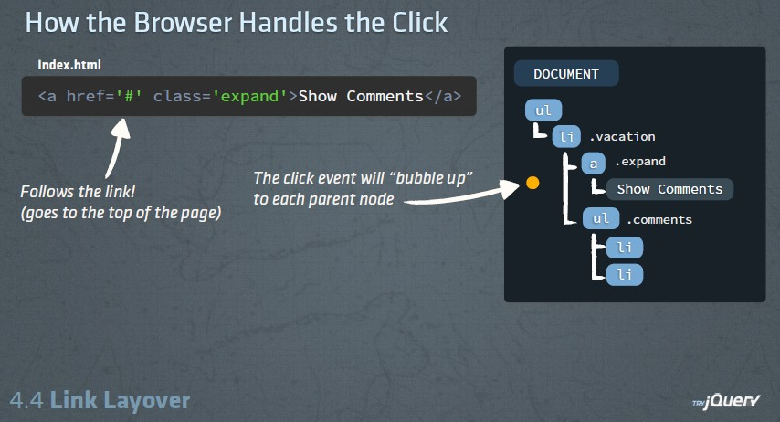

먼저 event가 브라우저에서 전파(propagation)의 과정을 보자  
button을 click 하면 button의 부모 tag들도 전부 반응하게 된다  
이 현상을 bubble up 이라고 부른다

위 그림에서 `a` tag를 보면 부모 tag로 `li`, `ul`이 있다
따라서 `a` tag 를 click하면 click event가 `li`, `ul`에게  
순차적으로 전달된다.  
그 결과, `ul`에 click event가 등록되어 있다면 그것이 실행되게 된다

##e.stopPropagation()
이를 실행하면

> 부모 tag에게 event를 전달하지 마!

라는 의미가 된다

따라서 `a` tag의 click event로 주어진 callback안에서  
e.stopPropagation을 실행하면  
click event는 `a` tag의 부모인 `li`, `ul`로 전달되지 않는다

##e.preventDefault()
이는 click event외에 브라우저의 다른 행동을 막기 위한 것이다  
따라서 e.preventDefault()를 실행하면  
브라우저가 하는 기본적인 event를 막게 된다
