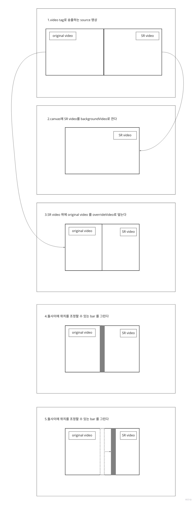

##Comparable Video Viewer component 만드는 순서


canvas와 video tag를 활용하여 영상을 비교하며 볼수 있는  
react component를 만드는 과정에 대해 설명하는 글이다

1. **canvas로 도형 렌더링하기:** 두 영상을 비교해서 보여줄 때 각 영상의 넓이를 조절하는 bar element를 그리기 위함이다
2. **video tag와 setInterval을 활용하여 canvas위에 영상 렌더링하기:** 바뀌는 video tag의 img src 값을 가져와서 canvas에 capture를 반복적으로 다시 렌더링하는 방법을 사용한다(useEffect를 활용)
3. **video를 2개의 image로 나눠서 canvas 위에 각각 렌더링하기:** drawImage를 활용한다 video를 캡쳐하여 canvas 위에 나눠서 그린다
4. **bar element를 움직일 수 있도록 만들기:** bar element의 x좌표를 state로 관리한다 canvas의 event listener를 활용하여 변경된 x좌표를 적용한다
5. **bar element의 위치에 따라서 2개의 image 보여주는 비율 조정하기:** drawImage를 module화 하여 x좌표 값을 변수로 할당한다 이미지 비율을 조정한다

##1. canvas 로 도형 렌더링하기
canvas 는 HTML5에서 등장한 tag이다  
canvas 위에는 2d 혹은 3d 의 다양한 도형과 이미지파일을 렌더링할 수 있다

사각형을 렌더링 과정은 아래와 같다

1. canvas의 넓이와 높이를 지정한다
2. `getContext()` 를 실행하여 2d 혹은 3d 를 결정하는 context 값을 얻는다
3. context.beginPath()로 그리는 연필을 시작점에 위치시킨다
4. fillStyle 에 그릴 도형의 색을 할당한다
5. context.rect(...)로 그릴 사각형의 크기를 결정한다
6. context.fill 로 사각형을 그린다

위 과정을 통해 알 수 있듯이  
canvas는 context를 가진다  
이 context 위에서 다양한 도형 혹은 이미지파일을 그리게 된다

이 canvas 위에서 움직이는 도형을 그리는 방법은  
setInterval을 사용하여 변화한 값을 반영하여  
반복적으로 다시 렌더링하는 것이다

##2. video 와 setInterval로 canvas에 영상 렌더링하기
react hook과 함께 setInterval을 사용하기 위해서는 `useEffect`가 필요하다
useEffect는 componentDidMount와 componentDidUpdate, componentWillUnmount까지 합친것과 비슷하다

```js
useEffect(() => {
  //componentDidMount
  return (
    //componentWillUnmount
  )
}, ['이 배열에 추가한 item이 바뀔때, componentDidUpdate 실행'])
```

위 코드에서처럼 componentDidMount 에서 setInterval을 설정하고  
component가 unmount 될 때 clearInterval 해준다  
또한 바뀌는 video와 state 를 배열에 추가한다  
이를 통해 마치 setInterval을 실행하는 것처럼 동작하게 만든다

실제 코드를 보자

```js{2,7,8}
useEffect(() => {
  const interval = setInterval(() => {
    if (video) {
      devineVideoToCanvasWithBar(video, canvasRef.current, video.videoWidth / 4)
    }
  })
  return () => clearInterval(interval)
}, [video, barX])
```

**첫번째 하이라이팅된 부분**  
setInterval이 실행되었다 이때 canvas에 video 캡쳐이미지를 그리는 함수  
`devineVideoToCanvasWithBar`가 실행되었다

**두번째 하이라이팅된 부분**  
component가 unmount될 때 실행되는 부분으로  
clearInterval 을 실행하고 있다

**세번째 하이라이팅된 부분**  
배열안에 video와 barX 2개의 item 이 있다  
video는 video tag이다  
barX는 bar element의 x 좌표이다
이 두가지가 변할때 useEffect는 실행된다

동작 순서는 아래와 같다

1. setInterval로 video 현재 송출 이미지를 캡쳐하여 canvas에 그린다
2. component가 unmount 된다
3. clearInterval로 정리한다
4. component가 mount 되면 setInterval을 다시 실행한다(이후 반복)

##3. video를 2개 이미지로 나눠 캡쳐 후 canvas에 렌더링하기


그림에서 확인할 수 있듯이 Source image가 video tag 화면이다  
video tag에 송출되는 영상을 캡쳐해 Destinaion canvas에 그리려고 한다

이때 주의할 점은 캡쳐해오는 image와 그릴 image의 **넓이를 변수**로 두는 것이다  
왜냐하면 움직이는 bar의 x좌표 즉 `barX`에 따라 **image의 넓이**가 바뀌기 때문이다

이 drawImage 를 활용하여 아래의 과정을 거쳐 video를 2개로 나눠 렌더링했다
위에서 보여준 그림 즉 전체 과정이다


##4. bar element를 움직일 수 있도록 만들기

```js
const barMove = (e: any) => {
  if (dragabble) {
    setBarX(e.pageX - canvasX)
  }
}
const mouseDown = (e: any) => {
  if (barX < e.pageX - canvasX && e.pageX - canvasX < barX + barWidth) {
    setBarX(e.pageX - canvasX - barWidth / 2)
    dragabble = true
    canvas.onmousemove = barMove
  }
}
const mouseUp = (e: any) => {
  dragabble = false
  canvas.onmousemove = null
  if (e.pageX - canvasX >= canvas.width - barWidth) {
    setBarX(canvas.width - barWidth)
  } else {
  }
}
const drawBar = (x: number, y: number, w: number, h: number, style: string) => {
  ctx.fillStyle = style
  ctx.rect(x, y, w, h)
  ctx.fill()
}

ctx.clearRect(0, 0, video.videoWidth / 2, video.videoHeight)

ctx.beginPath()
ctx.drawImage(...Object.values(backgroundVideoConfig))

ctx.beginPath()
ctx.drawImage(...Object.values(overrideVideoConfig))

ctx.beginPath()
drawBar(barX, 0, barWidth, video.videoHeight, '#444444')
다
canvas.onmousedown = mouseDown
canvas.onmouseup = mouseUp
```

전체 코드는 마지막에 다시한번 읽어보자  
아래에서는 함수를 하나씩 따로 설명할 것이다

###barMove()

```js
const barMove = (e: any) => {
  if (dragabble) {
    setBarX(e.pageX - canvasX)
  }
}
```

바가 움직일때 실행되는 함수이다  
setBarX로 barX 즉 bar의 x좌표 값을 바꾼다

- dragabble: 기본값 false bar위에 mousedown이 되면 true가 된다
- e.pageX: 현재 마우스의 x좌표 값
- canvasX: canvas tag의 x좌표 값

즉 현재 마우스의 x좌표 값에서 canvas tag의 x좌표값을 빼면  
canvas 위에서의 x좌표 값이 나온다

canvas 위에서의 x좌표 값으로 barX의 값을 수정한다

###mouseDown()

```js
const mouseDown = (e: any) => {
  if (barX < e.pageX - canvasX && e.pageX - canvasX < barX + barWidth) {
    setBarX(e.pageX - canvasX - barWidth / 2)
    dragabble = true
    canvas.onmousemove = barMove
  }
}
```

mouseDown은 bar 위에 mouse를 올린 후  
click하는 event까지 2개의 event가 모두 발생했을 경우 실행되는 함수이다

1. setBarX로 bar의 위치를 수정한다
2. dragabble을 true로 바꾸어 끌 수 있도록 준비한다
3. nmousemove에 barMove를 할당하여 마우스가 움직일 때 barMove를 실행한다

###mouseUp()

```js
const mouseUp = (e: any) => {
  dragabble = false
  canvas.onmousemove = null
  if (e.pageX - canvasX >= canvas.width - barWidth) {
    setBarX(canvas.width - barWidth)
  } else if (e.pageX - canvasX <= 0) {
    setBarX(0)
  }
}
```

mouseUp은 canvas 바깥으로 마우스가 나가고 click을 그만하면 실행되는 함수이다

1. dragabble 에 false를 할당한다
2. onmousemove에 null 값을 할당하여 callback을 지운다
3. 범위 바깥으로 나가면 가장자리에 bar 가 위치하도록 if문을 작성한다

###전체 동작 원리

```js
const drawBar = (x: number, y: number, w: number, h: number, style: string) => {
  ctx.fillStyle = style
  ctx.rect(x, y, w, h)
  ctx.fill()
}

ctx.clearRect(0, 0, video.videoWidth / 2, video.videoHeight)

ctx.beginPath()
ctx.drawImage(...Object.values(backgroundVideoConfig))

ctx.beginPath()
ctx.drawImage(...Object.values(overrideVideoConfig))

ctx.beginPath()
drawBar(barX, 0, barWidth, video.videoHeight, '#444444')

canvas.onmousedown = mouseDown
canvas.onmouseup = mouseUp
```

drawBar는 bar를 그리는 함수이다

동작 순서는 아래와 같다

1. clreaRect로 cavnas 안에 모든 것을 지운다
2. `ctx.drawImage(...Object.values(backgroundVideoConfig))`를 실행하여 SR video를 background에 깐다
3. `ctx.drawImage(...Object.values(overrideVideoConfig))`를 실행하여 original video를 그 위에 override 한다
4. drawBar로 위치가 수정된 bar를 그린다

위 과정을 setInterval을 통해 무한 반복하여 마치 재생되는 것처럼, bar가 움직이는 것처럼 보이게 한다

##5. bar element의 위치에 따라서 2개의 image 보여주는 비율 조정하기

```js{4, 6, 8, 10, 20, 24, 30}
ctx.beginPath()
const backgroundVideoConfig = {
  video,
  sourceX: video.videoWidth / 2 + barX,
  sourceY: 0,
  sourceWidth: video.videoWidth / 2 - barX,
  sourceHeight: video.videoHeight,
  drawX: barX,
  drawY: 0,
  drawWidth: video.videoWidth / 2 - barX,
  drawHeight: video.videoHeight,
}
ctx.drawImage(...Object.values(backgroundVideoConfig))

ctx.beginPath()
const overrideVideoConfig = {
  video,
  sourceX: 0,
  sourceY: 0,
  sourceWidth: barX,
  sourceHeight: video.videoHeight,
  drawX: 0,
  drawY: 0,
  drawWidth: barX,
  drawHeight: video.videoHeight,
}
ctx.drawImage(...Object.values(overrideVideoConfig))

ctx.beginPath()
drawBar(barX, 0, barWidth, video.videoHeight, '#444444')
```

하이라이팅된 부분들이 barX가 들어간 곳이다

위 코드가 진행되면서 canvas에 그려지는 element의 순서는 아래와 같다

1. background video
2. override video
3. bar

이때 2개의 video element가 그려질때 그 비율을  
barX로 즉, bar의 x좌표로 조절할 수 있다  
또한 bar가 그려지는 위치또한 x좌표로 조절할 수 있다

이를 통해 video가 보여지는 비율과 bar의 위치를  
조절하는 것이 가능해진다

##ComparableVideoViewer component 만들며 경험한 것

1. video src가 img src와 같은 비트맵 데이터임을 알고 활용함
2. canvas의 동작원리
3. react component 안에서 setInterval을 사용
4. canvas가 react와 조화롭게 동작하도록 변수를 state로 관리

##referneces

- canvas의 drawImage() : https://developer.mozilla.org/en-US/docs/Web/API/CanvasRenderingContext2D/drawImage
- bar element의 drag & drop : https://html5.litten.com/how-to-drag-and-drop-on-an-html5-canvas/
- canvas에 video 그리기 : https://developer.mozilla.org/ko/docs/Web/HTML/Canvas/Manipulating_video_using_canvas
