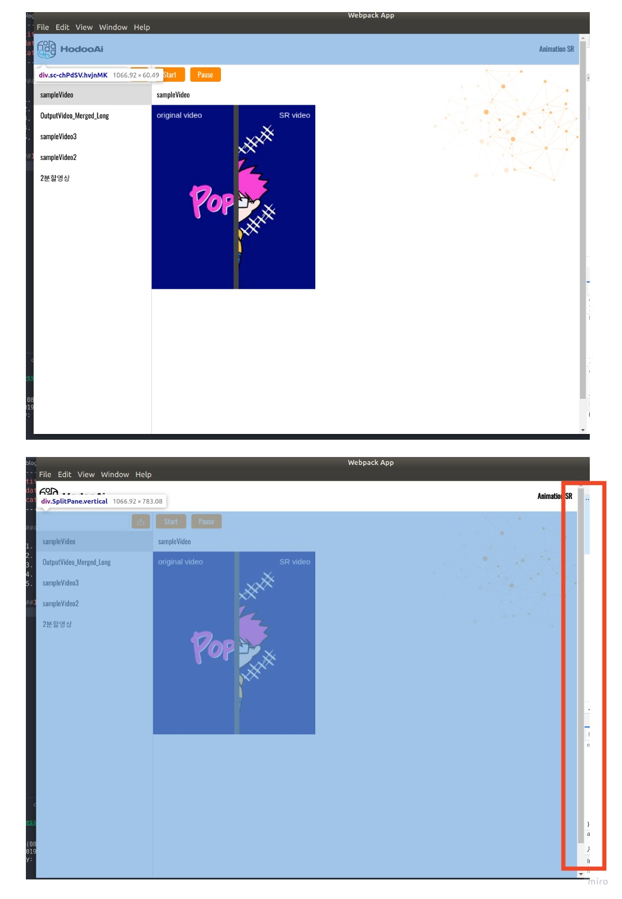
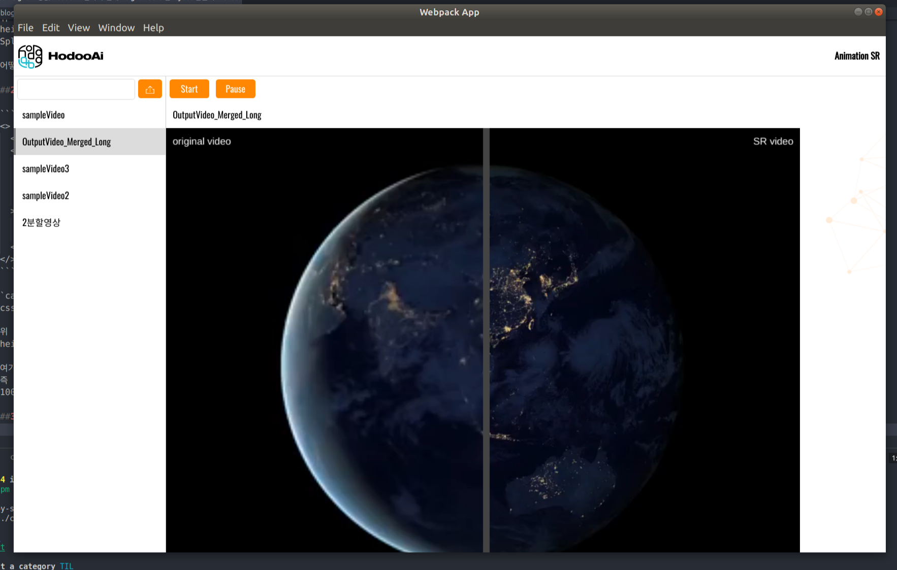
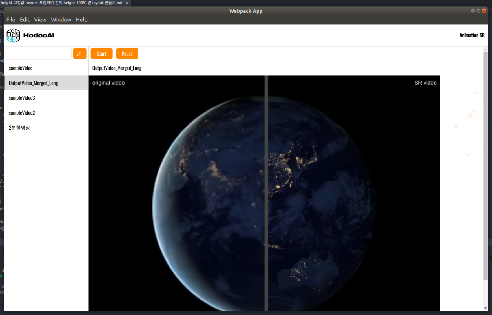

###Index

1. 문제: header의 height 가 고정값이고 content의 height는 100%이므로 content가 넘쳐서 scroll이 생긴다
2. 해결: content height에서 header의 height를 뺄 수 있는 방법은 없을까
3. 추가문제: content height 값이 고정되어 scroll이 생기지 않는다
4. 추가해결: overflow를 auto로 주자

##1. 문제: header height 고정값일 때 content height가 100%여서 넘치는 상황



위 화면에 파란색으로 override된 부분이 header이다
이 header는 line-height 값이 60px로 할당되어 있다  
또한 border-bottom 값이 0.5px로 할당되어  
총 `height` 값은 `60.5px` 이다

아래 코드를 보면 Header가 있고 SplitPane이 있음을 확인할 수 있다

```js
<>
  <Header />
  <SplitPane split="vertical" minSize={230} defaultSize={230}>
    <AnimList />
    <ComparableVideoViewer />
  </SplitPane>
</>
```

위 코드에서 SplitPane이 위 2개의 그림 중 아래그림의 파란부분이다  
height가 100%로 되어있어서 오른쪽 빨간 박스처럼 scroll이 생긴것을 확인할 수 있다
SplitPane 즉 content 내용은 넘어가지 않음에도 height가 100%기 때문에 scroll이 생긴것이다

어떻게하면 header와 SplitPane을 묶어서 화면에 100%로 렌더할 수 있을까

##2. 해결: `calc` content height에서 header height를 뺄 수 있는 방법

```js{4}
<>
  <Header />
  <SplitPane
    style={{ height: 'calc(100% - 60.5px)' }}
    split="vertical"
    minSize={230}
    defaultSize={230}
  >
    <AnimList />
    <ComparableVideoViewer />
  </SplitPane>
</>
```

`calc` 라는 연산자를 사용하면  
css property의 value값을 할당할 때 계산할 수 있다

위 코드에서 하이라이팅된 부분을 보자  
height값에 `calc(100% - 60.5px)` 를 할당했다

여기서 `60.5px`는 `Header`의 height 값이다
즉 content인 SplitPane의 height 값은  
100%에서 Header의 height 값을 뺀 값이 된다

##3. 추가문제: height 값이 고정되어 content 내용이 짤린다



위 그림에서처럼 content 내용이 SplitPane보다 height값이 커지면  
아래 부분이 짤린다

이럴 때는 scroll이 생겨 아래 부분을 확인할 수 있도록 해주어야 한다

##4. 추가해결: overflow에 auto 값을 주자

```js{4}
<>
  <Header />
  <SplitPane
    style={{ height: 'calc(100% - 60.5px)', overflow: 'auto' }}
    split="vertical"
    minSize={230}
    defaultSize={230}
  >
    <AnimList />
    <ComparableVideoViewer />
  </SplitPane>
</>
```

위 코드에서 하이라이팅된 부분을 보자  
overflow의 auto 값을 주었다

따라서 아래 그림처럼 content 내용이 넘치게 되면  
자동으로 scroll이 생기게 되었다



##Outro
고정된 높이를 가진 header를 포함한 layout을 만들때  
css property 값을 계산하여 할당하는 방법이 있다는 것을 알게되었다

> `calc`를 사용하면 css property 값을 계산하여 할당할 수 있다

이를 통해 유동적인 height와 고정된 height 값을 자유롭게 혼합하여 쓸 수 있게 되었다

##references

- https://src-bin.com/ko/q/9f035
