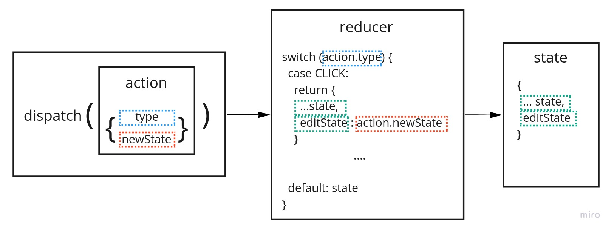

redux의 핵심개념인 reducer를 간단하게 구현한 hooks이다

##useReducer 기본 사용법

```js
const [state, dispatch] = useReducer(reducer, initialState)
```

##redux의 핵심개념



- action: object형태로 type과 data를 포함한다. state를 변화시키는 목적을 가진다
- dispatch: action을 reducer로 전달한다
- reducer: action을 받아서 state를 변화시킨다
- state: 여러 state 값을 저장한다. reducer 에서 새로운 state값을 받아서 변화한다

##redux와 차이
redux-saga 등 middleware가 없으므로  
비동기 처리가 어려운 한계점이 있다
작은 app에는 useReducer로 충분할 듯
