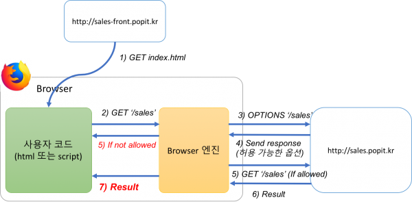

same-origin policy 는  
web application의 security model에서 중요한 역할을 한다

정책(policy) 아래에서  
web browser는 첫번째 web page에서 포함한 script만  
두번째 web page의 data를 얻기 위한 접근을 허락한다  
오직 두 web page가 **same origin** 일때만!

##origin
origin이란 URI scheme, host name, port number 의 조합이다
구체적으로 protocol, host, port이다

`http://store.company.com/dir2/other.html`
위와 같은 URL이 있을 때,

same origin policy를 **준수**한 URL은 아래와 같다

- `http://store.company.com/dir/inner/another.html`

same origin policy를 **위반**한 URL은 아래와 같다

- protocol 차이: https://store.company.com/secure.html
- port 차이: http://store.company.com:81/dir/etc.html
- host 차이: http://news.company.com/dir/other.html

> 왜 same origini policy를 준수해야 하나?

CORS 이슈 때문이다

##CORS란?
Cross Origin Resource Sharing의 약자로 browser의 현재 web page가
이 page를 받은 server가 아닌 다른 server의 resource를 호출하는 경우를 말한다

흔한 예로 CDN예 배포되어 있거나 공용 이미지를 단순 link로 사용하는 것이 있다
(CDN - Contents Delivery Network - content를 다운 받을 때  
멀리 있는 server에서 받으면 오래걸리므로, 가까운 server에 caching 해놓고 받는 기술)

##CORS를 악용하면?
다른 server의 resource를 호출할 수 있다는 것은  
해당 web page에 다른 request를 보낼 수 있다는 것

예를 들어 특정 URL(해당 web page에 게시된 광고)의 조회수를  
의도적으로 높이는 request를 보낼 수 있게 됨

즉, 외부(다른 origin)에서 보낸 javascript도 실행가능하기 때문에  
보안에 취약하다

##보안 취약 문제 해결책
CORS가 발생한 경우 browser는 아래 과정을 거친다

- 아래 일반적인 요청의 경우, 아무런 처리도 하지 않음
  - Accept, Accept-Language, Content-Langugage
  - Content-type
    - application/x-www-form-urlencoded
    - multipart/form-data
    - text/plain
- 일반적인 요청이 아닌 경우
  1. browser는 resource를 가져올 server에게 preflighted request 보냄
  2. method = OPTIONS로 preflighted request 보냄
  3. server는 OPTIONS request 받고 response header에 server가 허용할 option 을 설정하여 response 보냄
  4. browser는 server의 response를 받고 허용되지 않은 request의 경우, 405 Method Not Allowed error 발생시키고 실제 request는 server로 보내지 않음
  5. server의 response를 받고 허용된 request로 확인된 경우, 실제 request를 server로 보냄
