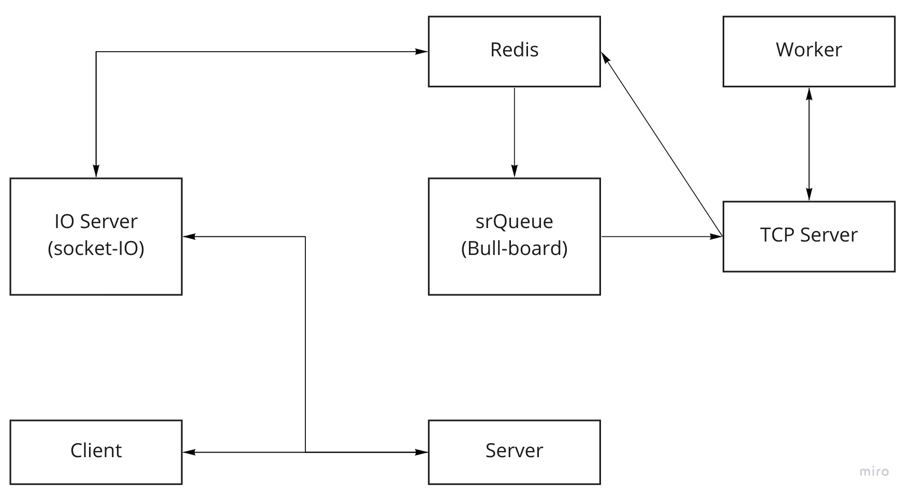

웹사이트에 영상을 올리면 AI model이 화질을 개선해주는  
서비스를 제공하는 demo 웹사이트를 만들었다  
위 그림은 해당 웹사이트의 시스템 아키텍쳐이다

## service work flow

1. socketIO server를 만들어 server와 client를 연결한다
2. user가 client에 file을 add 한다
3. client에서 server로 해당 file을 post 한다
4. server는 file을 저장한다
5. client에서 socket으로 subscribe를 emit 한다
6. redis는 socket을 듣고 있다가 subscribe가 오면 srQueue를 만든다
7. srQueue에 job이 더해지면 TCP server를 만든다
8. TCP server가 listen 하게 된다
9. worker가 file을 처리(화질 개선)하기 시작한다
10. 처리된 file을 TCP server로 보내준다
11. TCP server는 처리된 file을 redis로 보낸다
12. redis를 듣고 있던 socket이 처리된 file을 client에게 전달한다
13. client는 처리된 file을 받아 video source에 넣는다
