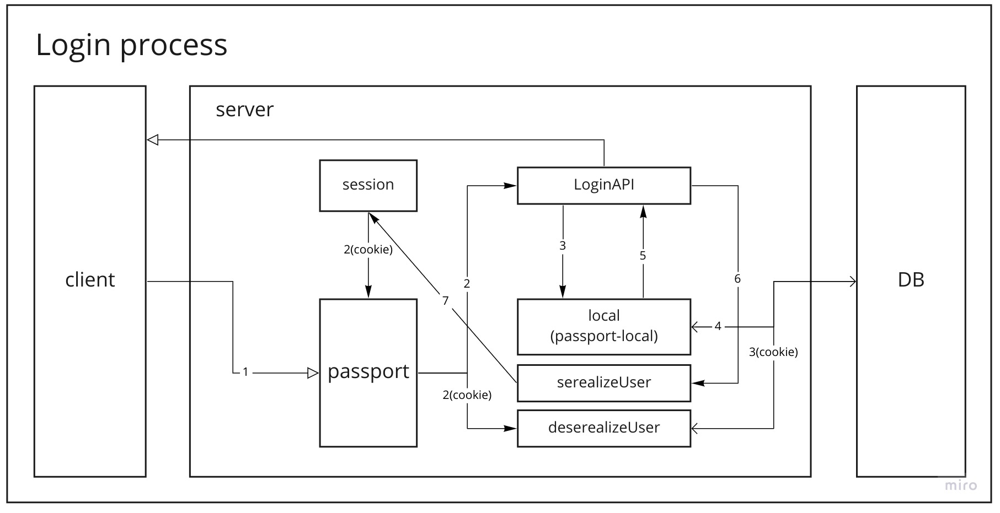

loginAPI를 구현할 때 authentication 방법은 여러가지다  
그 중 쿠키와 세션을 활용한 방법이 있다

쿠키를 client에게 주고  
client가 요청을 보낼때마다 쿠키를 확인하여  
해당 client가 authentication 을 통과했는지 판단할 수 있다

passport는 이 과정을 도와주는 library이다

## login api 진행 과정



1. client로부터 withCredentials를 true인 login 요청이 온다
2. client에게 cookie 있고 없고에 따라 passport에 의해 다른 로직이 실행됨
   - client에게 cookie가 있다면 deserializeUser를 실행한다
   - client에게 cookie가 없다면 login api를 실행한다
3. login api에 `passport.authenticate('local', callback)` 에 의해 passport/local.js를 실행한다
4. local.js가 db에서 user 정보를 찾는다
5. db에서 일치하는 user를 찾았다면 해당 user를 `passport.authenticate('local', callback)` 의 callback에 넘긴다
6. callback을 실행하여 retrun req.login을 호출하고, 동시에 passport의 serializeUser를 실행한다
7. serializeUser 에서 해당 user의 userId를 session에 저장한다
8. req.login이 이어서 실행되어 client에게 response로 해당 user의 data를 보내준다(client에 cookie가 저장된다)

각 진행 과정은 아래에서 자세하게 설명한다

## 2. client가 withCredentials를 true인 login 요청을 보내는 방법

```js
function loginApi(loginData) {
  return axios.post('/user/login', loginData, {
    withCredentials: true,
  })
}
```

위 코드에서처럼 `withCredentials`에 true를 주게되면  
server에서는 이 요청을 cookie를 확인해달라는 요청으로 인식한다
따라서 passport/index.js 의 deserializeUser를 실행하게 된다

## 2. cookie 유무에 따른 passport/index.js의 다른 로직들

- serializeUser: session id를 만들어 저장한다
- deserializeUser: cookie가 있는 client의 요청을 인증한다
- local: cookie가 없는 client를 확인한다

passport는 위 3가지 로직으로 작성되어 있다
각 로직은 아래에 자세하게 설명하겠다

### 7. serializeUser(위 과정의 7번에 해당)

req.login()이 실행될 때 실행된다
해당 userId를 session에 저장한다  
(req.session.passport.user.userId에 해당 userId를 저장)

### deserializeUser(cookie가 있는 요청을 처리하는 로직)

client에게 cookie가 있다면 session을 살펴본 후  
session id와 일치하는 userId를 넘겨받는다
이 userId를 활용해 해당 user 정보를 찾는다
해당 user 정보를 req.user에 저장한다

### 3. local(passport/local.js)

client에게 cookie가 없다면 실행된다
passport/local.js 을 실행한다  
아래에서 자세하게 설명한다

## 4. 5. passport/local.js

server에서 passport/local.js 로직은 아래 순서로 구현되어 있다

1. userId와 password를 받는다
2. userId 로 db 확인해서 맞는 user 찾고
3. user 없는 경우 error
4. password 틀린 경우 error
5. user가 있고 password 맞는 경우 user를 authenticate 뒤에 callback에게 넘긴다

## cookie를 가지고 api 요청이 오는 경우

1. client가 cookie를 가지고 요청을 한다
2. passport의 deserializeUser를 실행한다
3. cookie에 맞는 session id를 활용해 db에서 해당 user를 찾는다
4. 해당 user를 req.user에 저장한다
5. user가 저장된 상태로 요청에 맞는 api 로직을 수행한다
